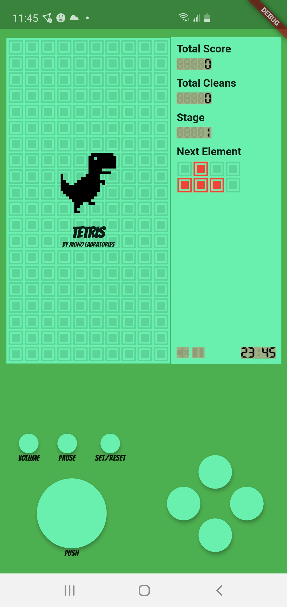
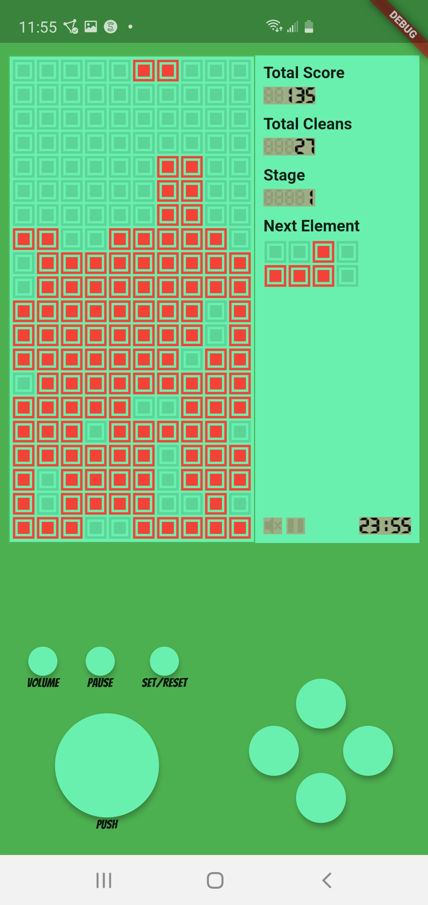

# tetrisymono

------------------------------------------------------------------------
This is the project README file. Here, you should describe your project.
Tell the reader (someone who does not know anything about this project)
all he/she needs to know. The comments should usually include at least:
------------------------------------------------------------------------

PROJECT TITLE:tetris_y_mono\n
VERSION or DATE: Apr 20, 2020\n
AUTHORS: Mo'men Mushtaha\n
PURPOSE OF PROJECT:\n
Implementation of Classic Tetris\n

